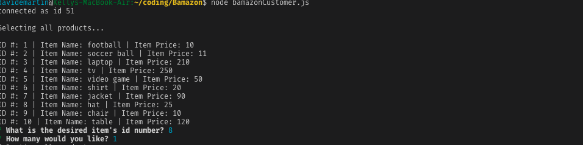
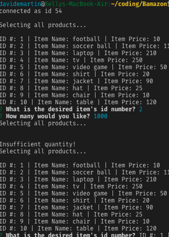
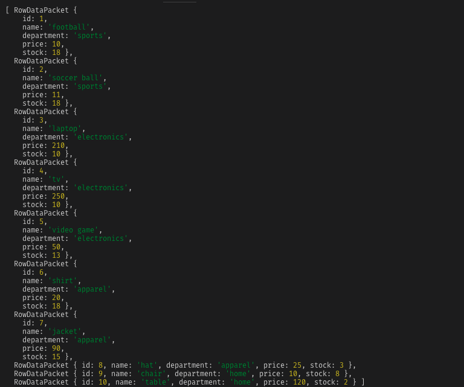

# Bamazon
This command line app is designed to let users purchase items from a list stored in a database set up using mysql.
The items available are displayed to the user on the console before prompts ask them to input the id number and quantity of the item they wish to purchase. 
When the user selects an id number and quantity they are shown the total price and that their purchase was successful.
If the user selects a higher quantity than the inventory has it logs a message of insufficient quantity and prompts user to start again. 
If we log all the connection query results the user can see that the database is updating quantity as items are sold.
The inquirer and mysql npm packages are included at the top, in addition to the database connection object. They are followed by functions that: display the list of items, prompt the user for input, check the item's id number, and make the purchase. The schema for the database was made using mysql workbench.
To run the app the user must be in the active directory in the terminal and type: node bamazonCustomer.js and then follow the prompts to input an item and quantity.

